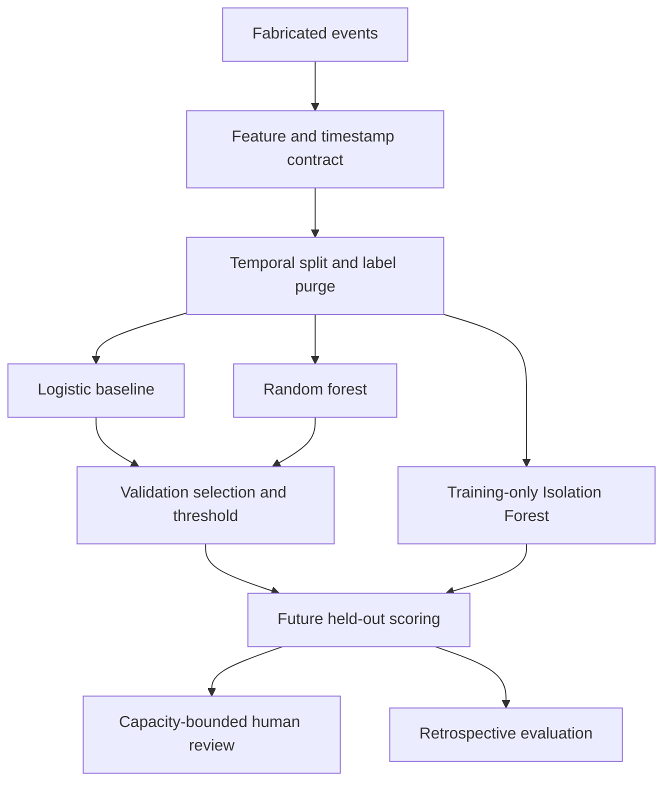

# Synthetic Advertising-Integrity ML Demonstration

This additive module uses an independent simulator. Its noisy binary outcome is a fabricated review-risk label, not observed fraud or legal guilt.

## Design

Features are fabricated summaries of trailing activity that are marked available at midnight; the event decision occurs at the end of that day. Outcomes arrive seven days later. Those declared timestamps establish simulator availability only; they are not an audit of real data latency.

The date split is 60% training, 20% validation, and 20% test before purging unavailable outcomes. Every training label must have arrived before the earliest validation decision; every tuning label must arrive before the earliest test decision. The saved policy release is the last tuning-label availability time. Scoring rejects prior training/tuning IDs and decisions before release.

## Classification

A scaled, class-weighted logistic regression is the baseline; a bounded-depth class-weighted random forest is the candidate. Both fit on training data only. Selection uses validation average precision, then F1, then favors the logistic baseline on exact ties.

Each candidate's threshold maximizes validation F1 subject to a 0.55 precision target. If no threshold meets the target, a threshold above 1 disables classifier flags. A validation target is not a guarantee for future data.

A DummyClassifier fitted to the training prior provides a trivial comparison. Held-out reports include average precision, ROC AUC, Brier score, precision, recall, F1, prevalence, and confusion counts. Undefined discrimination metrics for single-class samples are recorded as null. Validation metrics are tuning results.

The predict_proba output from the class-weighted classifier is called a classifier score. Calibration is not fitted and the output is not claimed to be a reliable fraud probability.

## Anomaly scoring and queue

The Isolation Forest fits training features only. Its negated decision score is normalized with training 1st/99th percentiles and clipped to [0,1]. Anomaly normalization and reason thresholds never use test outcomes.

Priority is a fixed 0.80 classifier score + 0.20 anomaly score. These demonstration weights are not optimized or justified as superior. Retrospective results compare the combined, classifier-only, anomaly-only, and fixed-seed random queues at identical capacity.

Default capacity is the ceiling of 10% of scored events. Explicit capacity may be zero, and never admits more available events. Equal priorities use ascending event IDs, independent of input row order. The queue is event-level; it does not deduplicate account-level cases.

Reason codes describe strict training-tail exceedances plus classifier/anomaly signals. Equality with a zero-valued count quantile does not count as a high-count signal. Reasons are descriptive observations, not feature attribution, causal evidence, or enforcement findings.

Scored events and queues contain no labels or outcome-availability timestamps. Evaluation joins outcomes separately by unique event ID. Queue rows retain model/policy identity, case ID, rank, status, and recommended human review. No workflow for real enforcement or analyst adjudication is implemented.

## Reliability

Runtime contracts reject malformed metadata, missing/unknown features, non-finite values, invalid ranges, duplicate identifiers, and future features. The complete saved bundle includes estimators, feature order, threshold/status, anomaly reference, training reason cutoffs, and release time.

Each run builds in a temporary directory, checks model persistence, and publishes a hash receipt last. A process lock refuses overlapping writers and releases on process exit. Build failure preserves the last completed run. A publication interruption cannot leave a valid new receipt unless all files are present; consumers verify the receipt hashes.

Determinism is checked on identical inputs and dependency versions. Byte-level model portability across different environments is not promised.

## Limits and sources

The simulator intentionally associates features strongly with a latent label and increases late prevalence. Synthetic metrics verify software behavior; they do not establish real-world fraud detection. Randomly reused account IDs are excluded from features. The temporal evaluation does not demonstrate generalization to unseen accounts. Real measurement validity, labeling, account histories, calibration, fairness, capacity costs, and deployment monitoring require their own evidence.

Official API guidance: [threshold tuning](https://scikit-learn.org/stable/modules/classification_threshold.html), [probability calibration](https://scikit-learn.org/stable/modules/calibration.html), and [Isolation Forest](https://scikit-learn.org/stable/modules/generated/sklearn.ensemble.IsolationForest.html). Execution uses the pinned versions in `requirements-ml.txt`.
